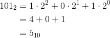
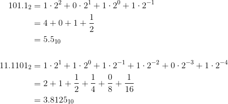
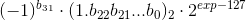
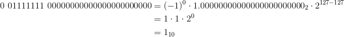
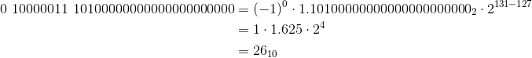
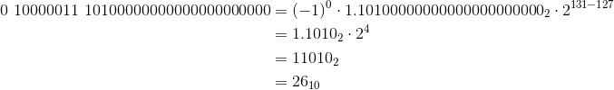
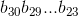

# Floating point numbers
This is an introduction to some of the basic concepts of floating point numbers in the [IEEE 754 floating point standard](https://en.wikipedia.org/wiki/IEEE_floating_point). We will build up to prove some interesting facts about their representation.

Let's start simple. How about a basic refresher on binary numbers (the subscript at the end of a number indicates its base):

### Binary review
*Converting a binary number to decimal:*

*With a binary fraction, we simply continue the pattern:*

### The floating point format
Single precision floating point numbers are laid out as follows:

* The 31st bit is the *sign bit*. A value of 0 indicates a positive number. A value of 1 indicates a negative number.
* The next 8 bits (30 through 23) give us the exponent *exp*
* The last 23 bits (22 through 0) give us the *fraction*

There are 32 bits in all.

More succinctly, here is the formula:

The first term in the formula gives the sign of the float via the *sign bit*.

The second term in the formula is a binary fraction.

The exponent *exp* is biased by subtracting 127. This allows our biased exponent to take both positive and negative values.

Here are some examples of converting from the single precision floating point format to a decimal number:
#### Ex1

#### Ex2

#### Ex3 (a different way of looking at Ex2)

In the last step, we simply move the decimal over four places. This is binary scientific notation!

Recall the single precision floating point number formula:

We can now see that floating point numbers are essentially represented in binary scientific notation. In particular, floating point numbers are expressed in [normalized scientific notation](https://en.wikipedia.org/wiki/Scientific_notation#Normalized_notation).

In binary scientific notation, all numbers are written in the form
. In normalized binary scientific notation,  the exponent *n* is chosen so that the absolute value of *m* remains at least one but less than two (1 ≤ |*m*| < 2).

With this knowledge, we can prove some interesting facts.

### Floating point representation uniqueness

*Claim:* Every number has a unique representation in the floating point binary format

*Proof:* This follows from the normalized scientific notation representation of floating point numbers. There is only one possible value for *m*, which determines the value of *n*.

### Lexicographical ordering of the floating point format
From [Bruce Dawson](http://www.cygnus-software.com/papers/comparingfloats/Comparing%20floating%20point%20numbers.htm):

>The IEEE float and double formats were designed so that the numbers are “lexicographically ordered”, which – in the words of IEEE architect William Kahan means “if two floating-point numbers in the same format are ordered ( say x < y ), then they are ordered the same way when their bits are reinterpreted as Sign-Magnitude integers.”

Let's try to prove this fact!

*Claim:* Let *f1* < *f2* where *f1* and *f2* are both positive floats. When their bits are interpreted as integers *i1* and *i2* respectively, *i1* < *i2*.

*Proof:* Recall the floating point representation:

Since *f1* and *f2* are positive, we know the sign bit will be zero for both.

We have two cases:

1. The exponent of *f1* is less than the exponent of *f2*
2. The exponent of *f1* is equal to the exponent of *f2*

Note that we cannot have the exponent of *f1* be greater than the exponent of *f2* -- that would violate our assumption that *f1* < *f2*.

Let  and  represent the eight exponent bits of *f1* and *f2* respectively. In case (1), we know that there exists some *i* between 23 and 30 (inclusive) such that  *bi* < *ci*, and for all *j* > *i*, *bj* = *cj*. In other words, if the exponent of *f2* is larger, there is a first digit where the exponent bits differ and *f2*'s is larger.

It follows that *i1* < *i2*, because the eight exponent bits precede the 23 fraction bits.

In case (2), since the exponents are equal, we know that the *f2*'s fraction must be larger than *f1*'s fraction. It follows that *i1* < *i2*.

### Addendum
I have not covered special cases in the floating point format, in particular the representation of zero and the representation of [subnormal numbers](https://en.wikipedia.org/wiki/Denormal_number) (that link does not give a great explanation of the concept, but I am unaware of a better source). Observant readers may have noticed there is no way to represent zero in the floating point format given the formulas I have provided!

Extending these proofs to cover the zero and subnormal cases is left as an excercise for the reader.

Another interesting fact that I will not go into extreme detail here is that for floats of the same sign:

1. Adjacent floats have adjacent integer representations
2. Incrementing the integer representation of a float moves to the next representable float, moving away from zero

(credit: [Bruce Dawson](https://randomascii.wordpress.com/2012/01/23/stupid-float-tricks-2/) for the wording of these facts)

Hopefully this introduction to floating point numbers is enough to give you an intuition on why these facts are true.
